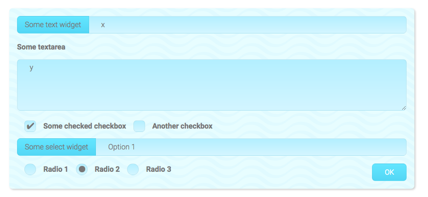
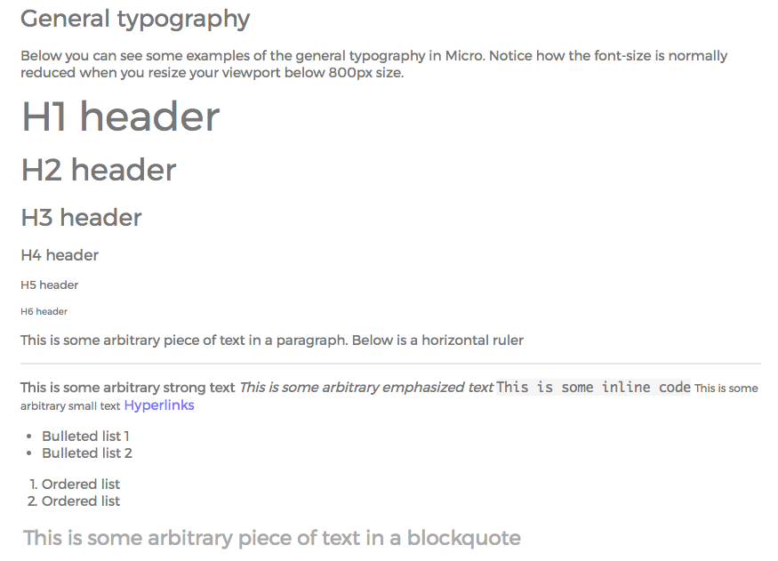
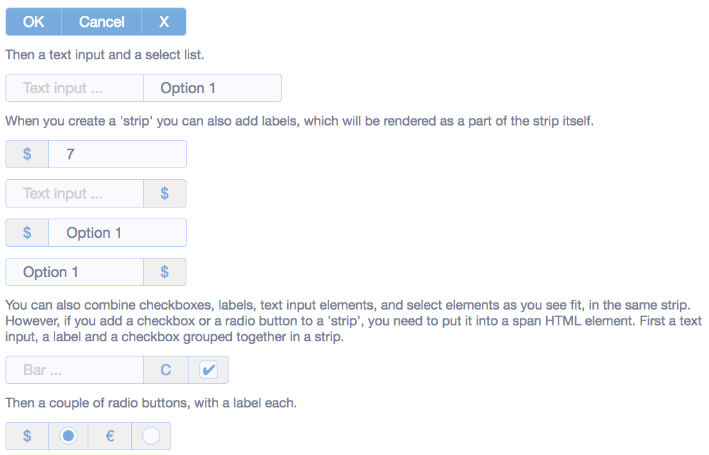
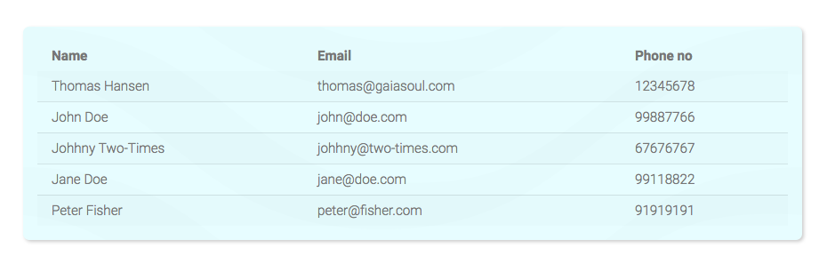
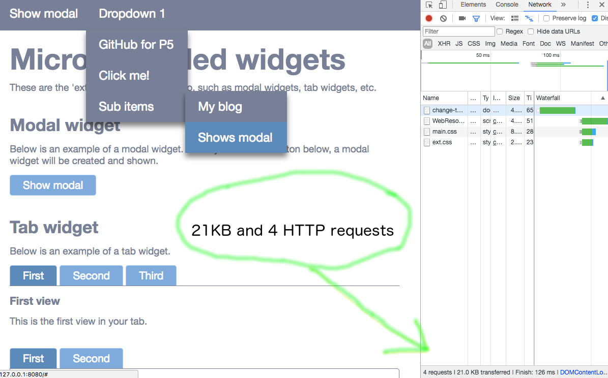
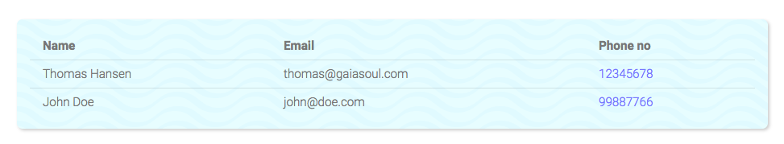
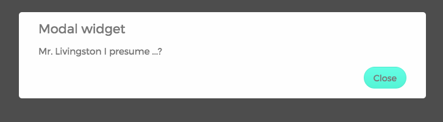
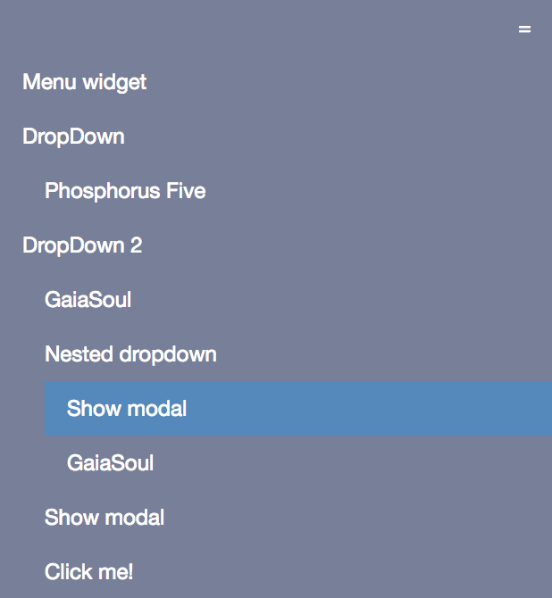
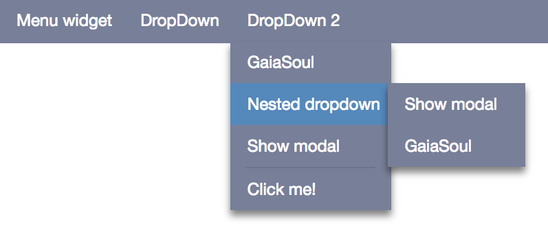
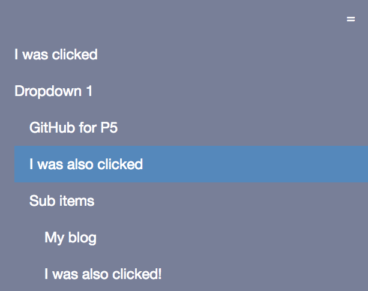

# Micro CSS and Ajax

Micro is a microscopic CSS and Ajax framework. It can be used stand alone as a pure CSS framework, but is 
also a perfect companion with [Phosphorus Five](https://github.com/polterguy/phosphorusfive). 
It was created because of Bootstrap being too big, and other smaller framework not having the 
necessary features. Most of the existing CSS framework were also too JavaScript centric, including Bootstrap.
Below is a screenshot of combining Micro with the Sea Breeze skin.



**Notice**, Micro does *not* mix well with Bootstrap, which among other things implies that
none of these examples can be seen very well in System42's Executor. If you wish to reproduce
these examples using [System42](https://github.com/polterguy/system42), you'll have to create a lambda CMS 
page, and make sure you set its _"template"_ settings to _"empty"_.

Micro creates a default layout, not based upon CSS classes for the most parts. This makes it easier in use,
but also more difficult to mix with other CSS frameworks. It is tiny in size, and contains most of the widgets 
you'll need in your day to day work with Phosphorus Five. It contains one main CSS file, and several extension widgets 
and components. Its main CSS file is `"/micro/media/main.css"`.

In addition it contains two skins, which builds upon the default layout and styles your widgets one
way or the other.

* _"/micro/media/skins/sea-breeze.css"_ - A light blue skin.
* _"/micro/media/skins/serious.css"_ - A more _'boring'_ gray skin.

## General layout

In general, Micro does as little as possible. However, most of your HTML elements, will have some sort of sane styling applied
to them. This means that it becomes tiny, while at the same time, leaving the design parts of your page up to you.
Below is a screenshot of how the general typography looks like in Micro if you apply the Forrest Dew skin.



If you don't apply a skin, there are no fancy fonts, and little layout in general unless you include a skin, since Micro only solves the bare minimum 
expected from every page you create - Leaving the rest up to you to explicitly solve as you wish. This implies that it 
doesn't _"end up as much in your way"_, as you apply your own custom design to your site, or create a skin for it. This trait of Micro also 
results in a _tiny_ bandwidth consumption.

In addition to a general sane default styling of your HTML elements, most form HTML elements also have some styling for you, that
will create a sane starting ground for your web apps. Below is another screenshot showing you what you may expect, unless you explicitly include
one of the 5 skins that comes out of the box - Or create your own skin, which is ridiculously easy for the record.



The above shows how your form elements will end up looking like, if they're embedded inside of a _"strip"_. All form elements can
also obviously be instantiated as stand-alone elements. Notice, the above screenshot has not included any skins.

The color profile of Micro is easily overridden by changing a couple of CSS variables, allowing you to change the colors of all elements,
by changing only a handful of variables.

## Grid system

Micro has its own grid system based upon the _"flexbox"_ model. This means among other things, that you can create as many or as few
columns as you wish in your page. Below is some example code that will create two rows, with a different set of columns each.

```
p5.web.include-css-file:@MICRO/media/main.css
set-widget-property:cnt
  class:container
create-widget
  class:row
  widgets
    literal
      class:col
      innerValue:Column 1
    literal
      class:col
      innerValue:Column 2
create-widget
  class:row
  widgets
    literal
      class:col
      innerValue:Column 1
    literal
      class:col
      innerValue:Column 2
    literal
      class:col
      innerValue:Column 3
```

Notice, you need to embed your content inside of either a _"container"_ or a _"container-fullscreen"_ element. Which is normally
done either by changing the CSS class of your main root widget, or appending a widget with the mentioned CSS classes inside of this widget
again. In the above example, we change the main root widget _"cnt"_ CSS class to container.

Inside of each _"container"_ you'll need a _"row"_. Each row can have as many _"col"_ items as you wish. Each col will share the
total available width, according to how many columns you add to a specific row.

The _"container"_ element will have a maximum width of 1120px and automatic margins to the left and right. The _"container-fullscreen"_ will 
use all available width. You can have as many containers as you wish on your page, and as many rows as you wish inside of each container.

The general layout of your page should be as follows.

- _'container'_ or _'container-fullscreen'_ element.
- _'row'_ elements inside of each container
- _'col'_ or _'col-x'_ elements inside of each row

In such a regard, it logically resembles the structure of Bootstrap CSS. You can nest rows inside of columns.

### Responsive rendering

Micro features what's known as _"responsive rendering"_, which means that if your screen resolution drops below 800px, each column, regardless of its definition,
will automatically pop out, and require 100% of the available width. Micro is created with the _"mobile first"_ approach.

### Explicit column width

You can also explicitly set a column's width, with one of the following CSS classes.

* col-10
* col-20
* col-25
* col-30
* col-33
* col-40
* col-50
* col-60
* col-67
* col-70
* col-75
* col-80
* col-90
* col-100

For instance, if you want to have two columns, where your first column is 33 percent of your page's width, you could use the following.

```
p5.web.include-css-file:@MICRO/media/main.css
set-widget-property:cnt
  class:container
create-widget
  class:row
  widgets
    literal
      class:col-33
      innerValue:Column 1
    literal
      class:col-67
      innerValue:Column 2

```

The total width of your columns should result in 100. If it exceeds 100, it will wrap the overflowed columns unto new rows. But you can also
avoid defining your column widths, at which point each column will take up an equal amount of width within your rows. If you want to have floating
widths of your columns like this, you can use the generic _'col'_ class on your columns, at which point your columns will divide the available width
amongst themselves, and become equally wide. Below is an example of three columns becoming equally wide, by sharing their available width between themselves.

```
p5.web.include-css-file:@MICRO/media/main.css
set-widget-property:cnt
  class:container
create-widget
  class:row
  widgets
    literal
      class:col
      innerValue:Column 1
    literal
      class:col
      innerValue:Column 2
    literal
      class:col
      innerValue:Column 3
```

Notice, also the generic _'col'_ class will be rendered responsively automatically for you, making your columns pop out and become 100% wide
if the width of the browser's viewport dips below 800px.

### Column offset

You can also offset a column's starting point, with one of the following CSS classes.

* offset-10
* offset-20
* offset-25
* offset-30
* offset-33
* offset-40
* offset-50
* offset-60
* offset-67
* offset-70
* offset-75
* offset-80
* offset-90

The same principle still applies as above, since the total number of any columns inside a single row, in addition to their offsets, 
must still add up to exactly 100. These offset classes are also completely ignored, making your columns become 100% width, 
if the browser's viewport dips below 800px.

## Form elements

Most form elements can simply be instantiated, without any CSS classes associated with them, and they will render with the style
associated with them correctly. If you wish, you can also add any form elements inside of a _"strip"_, which will make all
form elements inside of your strip become _"associated"_ with each other, creating a toolbar kind of effect.

If you want to add a radiobutton or a checkbox into your strip though, you'll have to wrap these elements inside of a _"span"_
element. Below is an example of creating a strip.

```
p5.web.include-css-file:@MICRO/media/main.css
p5.web.include-css-file:@MICRO/media/skins/sea-breeze.css
set-widget-property:cnt
  class:container
create-widget
  class:row
  widgets
    container
      class:col-100 strip
      widgets
        label
          innerValue:Foo
        input
          type:text
          placeholder:Foo ...
        span
          widgets
            input:my-check
              type:checkbox
        label
          innerValue:Check
          for:my-check
        button
          innerValue:OK
```

The above will result in something resembling the following, if you're using the Sea Breeze skin.


## Misc. classes

Micro also contains some semantic helper classes, such as _'error'_, _'emphasize'_, _'warning'_, etc.

## Tables

Tables are by default rendered with a single border between cells. If you add the _'striped'_ class to your table, every second rows will be rendered with a slightly darker background color. Below is an example of a striped table.



Notice the widget the above table is rendered within, also have the _'bg air-inner shaded rounded'_ classes associated with it, 
in addition to that we're using the Sea Breeze skin.

## Extension widgets

Micro contains some extension widgets which are documented below. Most of these extension widgets, will automatically include
the relevant CSS file(s).

### [micro.widgets.grid]

This is the _'datagrid'_ in Micro, which allows you to create tabular data, controlling any aspects of your view. It is at its core nothing but a thin abstraction over the _"table"_ HTML element, allowing you to dynamically databind the rows of your tbody element. Below is an example of how to create a datagrid.

```
p5.web.include-css-file:@MICRO/media/main.css
p5.web.include-css-file:@MICRO/media/skins/sea-breeze.css
create-widget
  class:container
  widgets
    container
      class:row air-top
      widgets
        div
          class:col-100
          widgets
            div
              class:bg air-inner shaded rounded
              widgets
                micro.widgets.grid
                  columns
                    Name
                    Email
                    Phone no
                  rows
                    item
                      Name:Thomas Hansen
                      Email:thomas@gaiasoul.com
                      Phone no:12345678
                    item
                      Name:John Doe
                      Email:john@doe.com
                      Phone no:99887766
                    item
                      Name:Johhny Two-Times
                      Email:johhny@two-times.com
                      Phone no:67676767
                    item
                      Name:Jane Doe
                      Email:jane@doe.com
                      Phone no:99118822
                    item
                      Name:Peter Fisher
                      Email:peter@fisher.com
                      Phone no:91919191
```

The above code will resemble the following.



#### Dynamically databinding your grid

You can invoke **[micro.widgets.grid.databind]** and pass in an **[item]** collection to databind the grid towards a different dataset later. For instance, consider the following code, which starts out with a single row, for then to change its content when the button is clicked.

```
p5.web.include-css-file:@MICRO/media/main.css
p5.web.include-css-file:@MICRO/media/skins/sea-breeze.css
create-widget
  class:container
  widgets
    container
      class:row air-top
      widgets
        div
          class:col-100
          widgets
            div
              class:bg air-inner shaded rounded
              widgets
                micro.widgets.grid:my-grid
                  columns
                    Name
                    Email
                    Phone no
                  rows
                    item
                      Name:Thomas Hansen
                      Email:thomas@gaiasoul.com
                      Phone no:12345678
    container
      class:row air-top
      widgets
        div
          class:col-100 right
          widgets
            button
              innerValue:Databind
              onclick
                micro.widgets.grid.databind:my-grid
                  item
                    Name:John Doe
                    Email:john@doe.com
                    Phone no:99887766
                  item
                    Name:Johhny Two-Times
                    Email:johhny@two-times.com
                    Phone no:67676767
```

Both of the above examples will create a simple HTML table for you, allowing you to dynamically change its rows. 

#### Complex cells

If you want to create more complex datagrid rows, that have complex widgets as their children - You can do this by applying a **[widgets]** collection to your items. The following illustrates how we could turn all _"Phone No"_ cells into clickable widgets.

```
p5.web.include-css-file:@MICRO/media/main.css
p5.web.include-css-file:@MICRO/media/skins/sea-breeze.css
create-widget
  class:container
  widgets
    container
      class:row air-top
      widgets
        div
          class:col-100
          widgets
            div
              class:bg air-inner shaded rounded
              widgets
                micro.widgets.grid:my-grid
                  columns
                    Name
                    Email
                    Phone no
                  rows
                    item
                      Name:Thomas Hansen
                      Email:thomas@gaiasoul.com
                      Phone no
                        widgets
                          a
                            href:#
                            role:button
                            innerValue:12345678
                            onclick
                              set-widget-property:x:/../*/_event?value
                                innerValue:I was clicked
                    item
                      Name:John Doe
                      Email:john@doe.com
                      Phone no
                        widgets
                          a
                            href:#
                            role:button
                            innerValue:99887766
                            onclick
                              set-widget-property:x:/../*/_event?value
                                innerValue:I was clicked

```

Which would resemble the following.



If you don't supply a **[widgets]** collection, the _"td"_ widget will be created as a literal widget, with its **[innerValue]** being the value of your item's argument.

All other arguments, besides **[widgets]**, that you pass into a specific cell when creating your items, will be added as properties/attributes to your cell. For instance, passing in the following item collection to it, either during creation, or during **[micro.widgets.grid.databind]**, would make sure your email cells becomes light blue.

```
  item
    Name:Thomas Hansen
    Email:thomas@gaiasoul.com
      style:"color:rgb(128,128,255);"
    Phone no:12345678
  item
    Name:John Doe
    Email:john@doe.com
      style:"color:rgb(128,128,255);"
    Phone no:99887766
```

#### Modifying the row

Sometimes you wish to modify the actual row of your items. This is easily done by adding a **[.row]** argument to your items. Either during initial creation, or when grid is databound. Below we have created a clickable row, which simply adds some styling to your row when it is clicked.

```
p5.web.include-css-file:@MICRO/media/main.css
p5.web.include-css-file:@MICRO/media/skins/sea-breeze.css
create-widget
  class:container
  widgets
    container
      class:row air-top
      widgets
        div
          class:col-100
          widgets
            div
              class:bg air-inner shaded rounded
              widgets
                micro.widgets.grid:my-grid
                  columns
                    Name
                    Email
                    Phone no
                  rows
                    item
                      .row
                        role:button
                        onclick
                          set-widget-property:x:/../*/_event?value
                            style:"background-color:rgba(128,255,128,.2);"
                      Name:Thomas Hansen
                      Email:thomas@gaiasoul.com
                      Phone no:12345678
                    item
                      .row
                        role:button
                        onclick
                          set-widget-property:x:/../*/_event?value
                            style:"background-color:rgba(128,255,128,.2);"
                      Name:John Doe
                      Email:john@doe.com
                      Phone no:99887766
```

The above code would make your row turn light green when clicked. Everything inside of your **[.rows]** will be appended as is, to the actual _"tr"_ element of your row.

#### Modifying your columns

You can also modify your columns with similar constructs. The following code makes sure the **[Name]** header becomes light green, and the **[Email]** header has its own widgets collection. Notice, like with modifying your cells, the construct is similar in that if you add a **[widgets]** collection to a header, it gets a widget collection - Everything else will simply be added as properties/attributes to your _"th"_ element.

```
p5.web.include-css-file:@MICRO/media/main.css
p5.web.include-css-file:@MICRO/media/skins/sea-breeze.css
create-widget
  class:container
  widgets
    container
      class:row air-top
      widgets
        div
          class:col-100
          widgets
            div
              class:bg air-inner shaded rounded
              widgets
                micro.widgets.grid:my-grid
                  columns
                    Name
                      style:"background-color:rgba(128,255,128,.2);"
                    Email
                      widgets
                        a
                          role:button
                          href:#
                          innerValue:Email
                          onclick
                            set-widget-property:x:/../*/_event?value
                              innerValue:Clicked!
                    Phone no
                  rows
                    item
                      Name:Thomas Hansen
                      Email:thomas@gaiasoul.com
                      Phone no:12345678
```

Or if you only wish to modify the _'tr'_ element of your thead element, your **[columns]** row that is, you can use the **[.row]** argument, inside of your **[columns]** declaration. Like the following incomplete example illustrates.

```
  micro.widgets.grid
    class:striped
    columns
      .row
        style:"background-color:rgba(128,255,128,.2);"
      Column 1
      Column 2

    /*
     * the rest of your grid declaration.
     */
```

#### Modifying your table

You can also modify the actual creation of your table element. Everything you add into your table which is neither **[columns]** nor **[rows]** nor **[.body]** will be added as properties/attributes to your _"table"_ element itself. Below we create a table having the _"foo"_ class, which once clicked, shows a modal widget.

```
p5.web.include-css-file:@MICRO/media/main.css
p5.web.include-css-file:@MICRO/media/skins/sea-breeze.css
create-widget
  class:container
  widgets
    container
      class:row air-top
      widgets
        div
          class:col-100
          widgets
            div
              class:bg air-inner shaded rounded
              widgets
                micro.widgets.grid:my-grid
                  class:foo
                  onclick
                    create-widgets
                      micro.widgets.modal
                        class:micro-modal
                        widgets
                          h3
                            innerValue:Table was clicked!
                  columns
                    Name
                    Email
                    Phone no
                  rows
                    item
                      Name:Thomas Hansen
                      Email:thomas@gaiasoul.com
                      Phone no:12345678
```

You can also supply a **[.body]** argument to your invocation, to modify on the _'tbody'_ widget only, and not the entire table. Consider the following incomplete code.

```
  micro.widgets.grid
    .body
      style:"background-color:rgba(128,255,128,.2);"

    /*
     * Rest of grid declaration.
     */
```

If you only wish to modify the _'thead'_ widget instead, you can do such a thing with the following code.

```
  micro.widgets.grid
    columns
      .head
        style:"background-color:rgba(128,255,128,.2);"
      Column 1
      Column 2

    /*
     * Rest of grid declaration.
     */
```

#### Kitchen sink datagrid example

Below is an example using all the bells and whistles of the **[micro.widgets.grid]** extension widget.

```
p5.web.include-css-file:@MICRO/media/main.css
p5.web.include-css-file:@MICRO/media/skins/sea-breeze.css
create-widget
  class:container
  widgets
    container
      class:row air-top
      widgets
        div
          class:col-100
          widgets
            div
              class:bg air-inner shaded rounded
              widgets
                micro.widgets.grid
                  class:striped
                  .body
                    style:"font-size:.8em;"
                  .head
                    style:"background-color:rgba(128,128,255,.2);"
                  columns
                    .row
                      style:"background-color:rgba(128,255,128,.2);"
                    Name
                      style:"color:rgb(0,255,0);"
                    Email
                      widgets
                        a
                          href:"https://gaiasoul.com"
                          target:_blank
                          innerValue:Email
                    Phone no
                  rows
                    item
                      .row
                        style:"background-color:rgba(128,128,255,.2);"
                      Name:Thomas Hansen
                        style:"font-size:1.2em;"
                      Email:thomas@gaiasoul.com
                        widgets
                          a
                            href:#
                            innerValue:Email
                            onclick
                              set-widget-property:x:/../*/_event?value
                                innerValue:I was clicked!
                      Phone no:12345678
                    item
                      Name:John Doe
                      Email:john@doe.com
                      Phone no:99887766
```

#### Datagrid Ninja tricks

A Ninja trick you should take advantage of, is to create your own specialized datagrids as extension widgets, that first changes the given data, for then to invoke **[micro.widgets.grid]** internally, and returns the results of that invocation. This way you'd avoid having to repeat yourself, and have your own specialized grids, for displaying whatever data source you wish to display in a uniform way.

Notice, if you do this, you would only need to modify the **[columns]** definition, as long as you don't supply any static **[rows]**, but rather rely upon invoking your own specialized version of **[micro.widgets.grid.databind]** event, which internally invoke the base databind event.

The grid in Micro is a very thin layer of abstraction on top of an HTML table widget. This comes with the added cost of making it more verbose to consume when you have special needs. However, it also implies that there does not exist any datagrid you could possibly want to display in this world, that you could not easily create using the Micro grid. To fix the first problem, create your own extension widget, which internally invokes **[micro.widgets.grid]** after first having _"massaged"_ the given data. Then create your own specialized version of **[micro.widgets.grid.databind]**. This makes your code very _"DRY"_.

I would not recommend you to consume the grid in Micro directly, unless you're creating a _"boring"_ HTML table for the above reasons - But rather recommend you to create your own extension widget, based upon the **[micro.widgets.grid]** and **[micro.widgets.grid.databind]** events themselves. I will be creating some examples of how to do this over at [my blog](https://gaiasoul.com).

I have already written a blog that demonstrates how to use the grid in Micro, which you can see [here](https://gaiasoul.com/2017/07/07/creating-a-million-ajax-datagrids-in-20-minutes-aphrodite-kiss/).

### [micro.widgets.modal]

A tiny modal widget, allowing you to easily create modal windows in your apps. Example usage can be found below.

```
p5.web.include-css-file:@MICRO/media/main.css
p5.web.include-css-file:@MICRO/media/skins/forrest-dew.css
create-widgets
  micro.widgets.modal:modal-widget-1
    class:micro-modal
    widgets
      h3
        innerValue:Modal widget
      p
        innerValue:Mr. Livingston I presume ...?
      div
        class:right
        widgets
          button
            innerValue:Close
            onclick
              delete-widget:modal-widget-1
```

The above code will create a simple modal window, with a button allowing you to close your window.
The most important argument to this Active Event is the **[widgets]** argument, which is a collection of widgets,
that will become the "content" parts of your modal widget.

All other arguments, such as for instance the above **[class]** argument, will be automatically appended into the 
root element of your widget. The modal window expects a **[class]** property of _"micro-modal"_.

Below is a screenshot of how this will end up looking like.



### [micro.widgets.tab]

This is a tab control type of widget. An example of usage can be found below.

```
p5.web.include-css-file:@MICRO/media/main.css
p5.web.include-css-file:@MICRO/media/skins/forrest-dew.css
create-widget
  class:container
  widgets
    container
      class:row air-top
      widgets
        div
          class:col-100
          widgets
            micro.widgets.tab
              class:micro-tab micro-tab-border
              view
                name:First
                widgets
                  h4
                    innerValue:First view
                  p
                    innerValue:This is the first view in your tab.
              view
                name:Second
                widgets
                  h4
                    innerValue:Second view
                  p
                    innerValue:Second view
              view
                name:Third
                widgets
                  h4
                    innerValue:Third view
                  p
                    innerValue:This is our third view
```

Your **[micro.widgets.tab]** widget needs a collection of one or more **[view]** items. Each view becomes a single tabview, and
needs at least a **[name]** and a **[widgets]** collection. The name becomes the name of your view, and also the text of the buttons
that allows you to change the active view. The **[widgets]** collection, becomes the content of your views.

All other arguments to your **[view]**, are appended into the main container widget of your specific view. Below is a screenshot of how the above code will end up appearing on your site.



The tab widget needs a **[class]** property of _"micro-tab"_ to function correctly. If you wish, you can add an additional CSS class
to it, to create borders around the tab widget. If you want to have borders, make sure you also add the _"micro-tab-border"_ CSS class 
to it when instantiating it. This will create some additional padding for your tab widgets though, which means that the content of your 
tab views will not be perfectly aligned with the rest of the content on your page.

### [micro.widgets.menu]

Although you could create a "nav" element in Micro by hand, Micro also contains one helper Active Event extension widget for you that easily 
allows you to create Ajax and/or hyperlinks menus. A menu must have exactly one **[items]** collection. Each child node beneath your items, 
becomes a menu item. Each menu item, can either have an **[onclick]** for Ajax callbacks, an **[href]** for URL navigation, or its own 
**[items]** collection, creating nested menu items with dropdowns. You should in general not combine these, but choose only one 
for each menu item.

The name of your child node beneath your **[items]** collection, becomes the friendly name displayed to the user. The value is an optional
explicit ID for the actual anchor element of your menu. Below is an example of creating a menu.

```
p5.web.include-css-file:@MICRO/media/main.css
p5.web.include-css-file:@MICRO/media/skins/forrest-dew.css
create-widget:content-menu
  class:container-fullscreen
  events
  widgets
    micro.widgets.menu
      items
        Click me
          onclick
            set-widget-property:x:/../*/_event?value
              innerValue:I was clicked
        Dropdown 1
          items
            GitHub for P5
              href:"https://github.com/polterguy/phosphorusfive"
              target:_blank
            Click me to!:some-item
              onclick
                set-widget-property:some-item
                  innerValue:I was also clicked
            Sub items
              items
                My blog
                  href:"https://gaiasoul.com"
                  target:_blank
                Click me three!
                  onclick
                    set-widget-property:x:/../*/_event?value
                      innerValue:I was also clicked!
```

The above will result in something like the following


You can combine URL menu items having an **[href]** argument, with other menu items having an **[onclick]** Ajax lambda callback. But you should
not create menu items that have both of these constructs. All arguments besides from **[onclick]**, **[href]** and **[items]** becomes
appended into the main anchor widget of your menu item. Above you can see an example of how we added a **[target]** attribute to our widget,
which makes sure the page the menu item is linking to is opened up in another tab. To override the rendering of specific menu items, you could
for instance add a **[class]** attribute, which would change the rendering of your anchor element inside of your "li" widget.

The menu will expand its items upon hover, but for each item with a sub-menu, it can also explicitly be clicked, which will add an 'expanded'
CSS class to the "ul" element, forcing it to open, also for clients that doesn't handle the hover effect - Such as some tablets and smartphones.
This implies that it is friendly for clients with touch-screens that doesn't handle the hover CSS effect very well.

To create a separator, add a **[.separator]** menu item, with no value, and no children. This will render as an "hr" HTML element, and allow you 
to separate your individual menu items.

All arguments besides **[items]** will appended as is to the root _"nav"_ widget for your menu. Which allows you to for instance add a CSS class, set styling for it, etc.

#### Responsive menu rendering

If the client has less than 800px in width, the menu will collapse, and render a _"hamburger button"_, allowing you to explicitly expand the entire
menu. This is useful for small devices, such as smartphones, etc. Below is a screenshot of the same menu we created above, except the client has
been resized to illustrate how it will look like on smaller devices.



The _"hamburger button"_ in the top right corner toggles the expansion of your menu. Notice, contrary to the Bootstrap CSS navbar widget, the menu
extension widget in Micro allows you to nest menu items in multiple levels.

### [micro.widgets.wizard-form]

This extension widget allows you to rapidly declare a group of form controls that will be created in the _'most intelligent way possible'_.
This can signifintly reduce your amount of repetition, keeps your code very DRY, and also significantly reduce your LOC (lines of code) 
when creating forms. Below is an example of using it in combination with the Sea Breeze skin.

```
p5.web.include-css-file:@MICRO/media/main.css
p5.web.include-css-file:@MICRO/media/skins/sea-breeze.css
set-widget-property:cnt
  class:container
create-widget
  class:row
  widgets
    container
      class:col
      widgets

        /*
         * Creates our actual 'wizard form' widget.
         */
        micro.widgets.wizard-form:my-form
          class:bg air-inner rounded shaded
          text:text-widget
            info:Some text widget
          label
            for:textarea-widget
            innerValue:Some textarea
          textarea:textarea-widget
            info:Some multiline text ...
          checkbox:checkbox-widget-1
            info:Some checked checkbox
            checked
          br
          checkbox:checkbox-widget-2
            info:Another checkbox
          select:select-widget
            info:Some select widget
            options
              Option 1:option-1
              Option 2:option-2
          radio-group:radio-buttons-group
            options
              Radio 1:radio-widget-1
              Radio 2:radio-widget-2
                checked
              Radio 3:radio-widget-3
          div
            class:right
            widgets
              button
                innerValue:OK
                onclick

                  /*
                   * Serializing the 'form' and displays results 
                   * in a modal widget.
                   */
                  micro.widgets.wizard-form.value:my-form
                  eval-x:x:/+/**/pre/*/innerValue
                  create-widgets
                    micro.widgets.modal
                      class:micro-modal
                      widgets
                        h3
                          innerValue:Result
                        pre
                          innerValue:x:/@micro.widgets.wizard-form.value
```

The above code uses the **[micro.widgets.wizard-form.value]** Active Event to serialize the form's values, and displays them in a modal window 
when you click the OK button. Make sure you create a System42 CMS page, and set the _"template"_ to _"empty"_ if you'd like to test the
above code. The above code will resemble the following screenshot.


The **[micro.widgets.wizard-form]** extension widget, takes the following standard arguments.

* __[class]__ - Sets the root class for the widget.
* __[text]__ - Creates a text input widget.
* __[textarea]__ - Creates a textarea widget.
* __[select]__ - Creates a select dropdown widget.
* __[checkbox]__ - Creates a checkbox widget.
* __[radio-group]__ - Creates a group of radio buttons.
* __[collection]__ - Creates a nested wizard-form, recursively invoking itself, for the contents of its __[widgets]__ collection.

In the above code we use the CSS classes _'bg air-inner rounded shaded'_, which creates the rounded and shaded effect, in addition to 
the background rendering and the inner padding. All other arguments you supply to it, will be assumed are widget declarations, and created
as such. You can see an example of adding generic widgets to your forms in the above code, where we have a **[label]**, **[br]** and **[div]**
widget inside of it, in addition to our normal helper declarations.

Each widget in the above list takes except the **[radio-group]** requires an **[info]** argument, which will become some sort of label or 
textual helper information of some sort. For the **[text]** and **[select]** input widgets for instance, this will create a 'strip' widget, wrapping 
both a label having the info value, and an input element. For the **[checkbox]**, it will simply add a related label. For the **[textarea]** it will 
create a placeholder value. If you want to have a label for your textareas, you'll need to explicitly add it yourself, as we demonstrate 
in the above code.

Notice, the above declaration of our wizard form is 48 lines of code if we ignore the boiler plate code. If we had created a form of that 
complexity 'by hand', it would surely easily become at least 150-200 lines of code (LOC). The **[micro.widgets.wizard-form]** extension widget, 
allows you to easily create very rich forms, without having to repeat yourself, with a very small number of LOC (lines of code). However, this
comes at the cost of having slightly less flexibility when creating your forms.

To retrieve the value of your form, you can use the __[micro.widgets.wizard-form.value]__ lambda event, passing in the ID of your form.
This will retrieve the value of all form elements inside of your wizard-form recursively.

#### [radio-group] and [select] widgets

These two widgets requires an **[options]** argument, which will become the possible options the user can select. These options are in a
name/value structure, where the name of the option becomes the friendly displayed name, and its value becomes the value serialized
when the user selects that specific option element. All arguments you supply to your **[option]** children nodes, will be appended directly
into the specific option element. Above for instance, we are adding a **[checked]** argument to one of our radio button arguments. This
makes sure that the particular radio button becomes initially checked. To initially select a **[select]** dropdown widget's option,
add up a **[selected]** argument to it.

#### Dropping the IDs of your wizard form widgets

If you want to, you can rely upon the default ID generation for your wizard form widgets, and drop their values. How to retrieve its values 
if you do, is illustrated in the documentation for the **[micro.form.serialize]** Active Event. This can be useful if you for some reasons
have a wizard form, which might in theory be repeated multiple times on your page - While still preserving the semantically
correct data-field name when serializing your form.

#### Responsive rendering

Your **[micro.widgets.wizard-form]** widgets can be wrapped inside of a column class, by e.g. either directly wrapping it inside of a col,
or by adding some 'col-xx' class to its **[class]** declaration. If you do, it will 'pop' like any other column, and be responsively rendered.

### [micro.widgets.obscurer]

This is a useful widget if you have some lengthy operation, that might require a lot of time to finish, and you wish to obscure the page,
to prevent the user from doing other things, while the operation is in progress. It's kind of like a _'page wide'_ Ajax wait obscurer
window, that _'locks'_ the screen from being interacted with, by the user, as the operation is being evaluated.

By default, the obscurer widget will show some small animation while the operation is proceeding, giving the user visual clues
about that some lengthy operation is in progress. You can pass in your own custom message as **[message]** to the obscurer.
If you render the obscurer initially with a display of _'none'_, you can easily manipulate it from JavaScript, and by using the 
JavaScript API of p5.ajax, make it show as the user is raising an Ajax request. Alternatively, create a _'shadow'_ event, where you
show your obscurer, return back to the client, making the client automatically raise another real Ajax event, that actually performs
your lengthy job. For then to hide the obscurer from Hyperlambda when the job is finished.

There are many examples of how to use this widget, in e.g. [Sephia Five](https://github.com/polterguy/sephia-five)'s code.

### [micro.widgets.skin-selector]

This is a special extension widget, which simply makes it easy for you during development to select a skin on your page. It takes no
arguments, and probably shouldn't be used in real production sites - But is a nice little addition during development, to experiment
with sifferent skins, by simply selecting your skin from a select dropdown list. Notice, if you use the **[micro.widgets.skin-selector]** 
widget, you should not manually include any of the skin files yourself. When the user selects a skin, the page will refresh, to make sure
only the selected skin's CSS file is included.

## Helper Active Events

In addition to the above widgets, there exists a couple of helper Active Events in Micro.

* __[micro.windows.change-password]__ - Shows a window that allows the currently logged in user to change his password
* __[micro.windows.info]__ - Shows a _'bubble'_ window with some informative text to the user
* __[micro.css.add]__ - Adds a CSS class to one or more specified widgets
* __[micro.css.delete]__ - Deletes a CSS class from one or more specified widgets
* __[micro.css.toggle]__ - Toggles a CSS class in one or more specified widgets
* __[micro.page.set-focus]__ - Sets focus to a specific widget on your page
* __[micro.form.serialize]__ - Serialize all form elements from a specified widget
* __[micro.path.get-folder]__ - Returns only the folder path of the file evaluting some piece of code, if invoked from inside of a file evaluation
* __[micro.page.create-dropzone]__ - Turns your page into a _'dropzone'_, such that users can drag and drop files unto the surface of their browser, to upload these to the server
* __[micro.lambda.contract.min]__ - Allows you to verify that an Active Event invocation obeys by some specified _'contract'_.
* __[micro.lambda.contract.optional]__ - Allows you to verify that an Active Event invocation's optional arguments obeys by some specified _'contract'_.

### [micro.form.serialize]

This Active Event requires some explanation, since it is a very powerful, recursively serialization event, that allows you with a single
line of code, serialize all form elements recursively from some starting widget. In the above code for our **[micro.widgets.wizard-form]**
example for instance, we are using it indirectly to automatically serialize the entire form, with a single line of code.

Normally this event will return all form element values from the specified **[_arg]** widget you specify when you invoke it, according to an ID/value structure. However, if you wish, you can instead add up a **[.data-field]** property for your widgets, which will become the 'key' returned instead of the ID of your widgets. This is useful if you for some reasons need to create a form element with an automatic ID, but still want to
retrieve the form element's value with some semantically easily understood key/name. Below is an example of creating a wizard form using
this construct. Notice particularly the **[.data-field]** and **[.data-value]** in our code, and how they relate to the return values from **[micro.form.serialize]**.

```
p5.web.include-css-file:@MICRO/media/main.css
p5.web.include-css-file:@MICRO/media/skins/sea-breeze.css
set-widget-property:cnt
  class:container
create-widget
  class:row
  widgets
    container
      class:col
      widgets
      
        /*
         * Creates our actual 'wizard form' widget.
         */
        micro.widgets.wizard-form:my-form
          class:bg air-inner rounded shaded
          h3
            innerValue:My form
          text
            info:Some text widget
            .data-field:text
          checkbox
            info:Some checked checkbox
            checked
            .data-field:check
          select
            info:Some select widget
            .data-field:select
            options
              Option 1:option-1
              Option 2:option-2
          radio-group
            .data-field:radio
            options
              Radio 1
                .data-value:one
                checked
              Radio 2
                .data-value:two
          div
            class:right
            widgets
              button
                innerValue:OK
                onclick

                  /*
                   * Serializing the 'form' and displays results 
                   * in a modal widget.
                   */
                  micro.form.serialize:my-form
                  eval-x:x:/+/**/pre/*/innerValue
                  create-widgets
                    micro.widgets.modal
                      class:micro-modal
                      widgets
                        h3
                          innerValue:Result
                        pre
                          innerValue:x:/@micro.form.serialize
```

Notice how we have completely dropped our IDs in the above code - Still when we invoke our **[micro.form.serialize]** event, we get semantically
correct data-field names back. In general, this is done by adding a **[.data-field]** argument to each of the widgets you create. However,
the **[radio-group]** widget from our **[micro.widgets.wizard-form]** requires an additional **[.data-value]** argument for each option element,
if you wish to create it truly generically, not relying upon the automatically generated IDs in any ways. This is because for a radio button, the **[name]** attribute on the client side becomes the key for your widget, and this name attribute might not necessarily be possible to
create uniquely across your page, and still semantically, without risking having two radio button groups overlap in their names.

For a **[select]** widget, this is not a problem, since a select widget will simply serialize the 'option' element's value, which only needs to be 
unique within a single select element. But for a radio button (group), this might be a problem, having multiple radio button groups with 
overlapping names. Hence, if you wish to truly semantically retrieve a radio button group's value by semantic key/value, you'll need to in 
addition to adding a **[.data-field]** for the **[radio-group]** as a whole, also add a **[.data-value]** for each option element beneath your 
radio group.

This small inconvenience and added complexity for **[radio-group]** widgets, is unfortunately something dictated by the HTML standard, and not
possible to solve generically in P5.

Notice, the __[micro.widgets.wizard-form.value]__ lambda event for the wizard form, is just a thin layer on top of the __[micro.form.serialize]__ Active Event.
