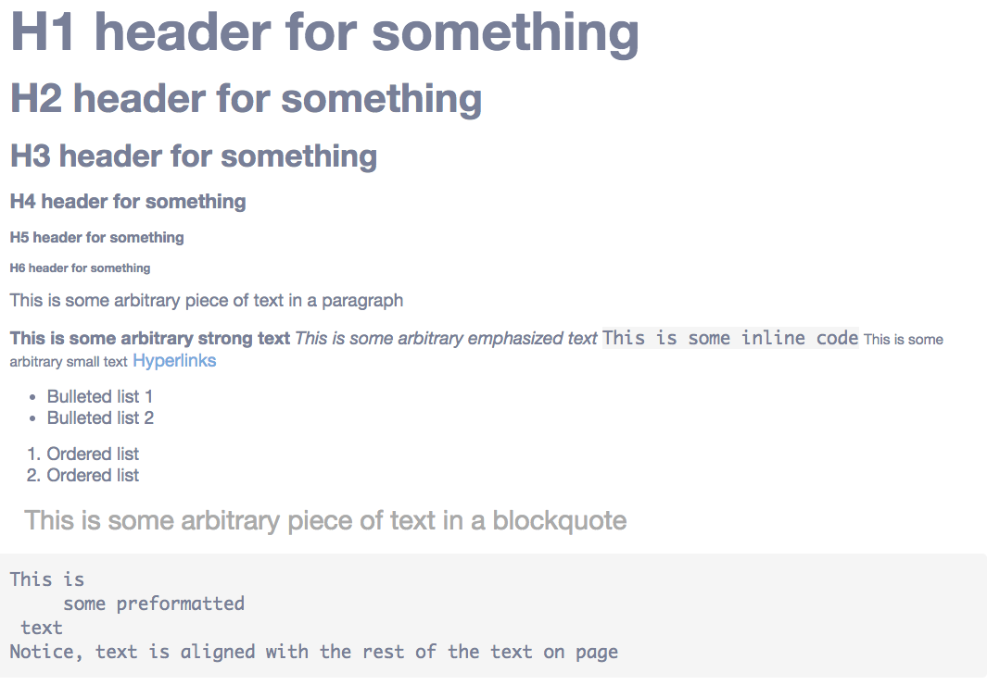
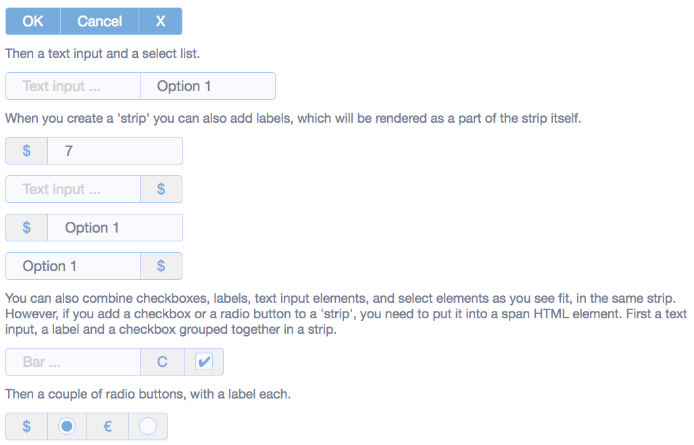

# Micro

Micro is a microscopic CSS framework. It can be used stand alone as a pure CSS framework, but is 
also a perfect companion with [Phosphorus Five](https://github.com/polterguy/phosphorusfive). 
It was created because of Bootstrap being too big, and other smaller framework not having the 
necessary features, and most of the CSS framework were too JavaScript centric - Including Bootstrap.

**Notice**, Micro does *not* mix well with Bootstrap, which among other things implies that
none of these examples can be seen very well in System42's Executor. If you wish to reproduce
these examples, using System42, you'll have to create a lambda CMS page, and make sure you set
its _"template"_ settings to _"empty"_.

Micro creates a default layout, not based upon CSS classes for the most parts, which means it does not
mix well with other CSS frameworks, such as e.g. Bootstrap. It is tiny in size, and contains most
of the widgets you'd need in your day to day work with Phosphorus Five. It contains 2 CSS files.

* _"/micro/media/main.css"_ Styles most common elements, such as buttons, checkboxes, etc.
* _"/micro/media/ext.css"_ Styles the extension widgets, such as the modal widget, tab widget, navbar menu widget, etc.

## General layout

In general, Micro does as little as possible. However, most of your HTML elements, will have some sort of sane styling applied
to them. Below is a screenshot of what you may expect.



In addition to a general sane default styling of your HTML elements, most form HTML elements also have some styling for you, that
will create a sane starting ground for your web apps. Below is another screenshot showing you what you may expect.



The above shows how your form elements will end up looking like, if they're embedded inside of a _"strip"_. All form elements can
also obviously be instantiated as stand-alone elements.

## Extension widgets

It contains some extension widgets which are documented below. All of these extension widgets, will automatically include
the relevant CSS files.

### [micro.widgets.modal]

A tiny modal widget, allowing you to easily create modal windows in your apps. Example usage can be found below.

```
create-widgets
  micro.widgets.modal:modal-widget-1
    class:micro-modal
    widgets
      h3
        innerValue:Menu widget
      p
        innerValue:You just clicked a link in the menu widget.
      div
        class:right
        widgets
          button
            innerValue:Close
            onclick
              delete-widget:modal-widget-1
```

The above code will create a simple modal window, with a button allowing you to close your window.
The most important argument to this Active Event is the **[widgets]** argument, which is a collection of widgets,
that will become the "content" parts of your modal widget.

All other arguments, such as for instance the above **[class]** argument, will be automatically appended into the 
root element of your widget. The modal window expects a **[class]** property of _"micro-modal"_.

### [micro.widgets.tab]

This is a tab control type of widget, and an example of usage can be found below.

```
create-widget
  class:container
  widgets
    container
      class:row prepend-top
      widgets
        div
          class:col-100
          widgets
            micro.widgets.tab
              class:micro-tab
              view
                name:First
                widgets
                  h4
                    innerValue:First view
                  p
                    innerValue:This is the first view in your tab.
              view
                name:Second
                widgets
                  h4
                    innerValue:Second view
                  p
                    innerValue:Second view
              view
                name:Third
                widgets
                  h4
                    innerValue:Third view
                  p
                    innerValue:This is our third view
```

Your **[micro.widgets.tab]** widget needs a collection of one or more **[view]**s. Each view becomes a single tabview, and
needs at least a **[name]** and a **[widgets]** collection. The name becomes the name of your view, and also the text of the buttons
that allows you to change the active view. The **[widgets]** collection, becomes the content of your views.

All other arguments to your **[view]**s becomes appended into the main container widget of your specific view.

The tab widget needs a **[class]** property of _"micro-tab"_ to function correctly. If you wish, you can add an additional CSS class
to it, to create borders around the tab widget. If you want to have borders, make sure you also add the _"micro-tab-border"_ CSS class 
to it when instantiating it. This will create some additional padding for your tab widgets though, which means that the content of your 
tab views will not be perfectly aligned with the rest of the content on your page.


