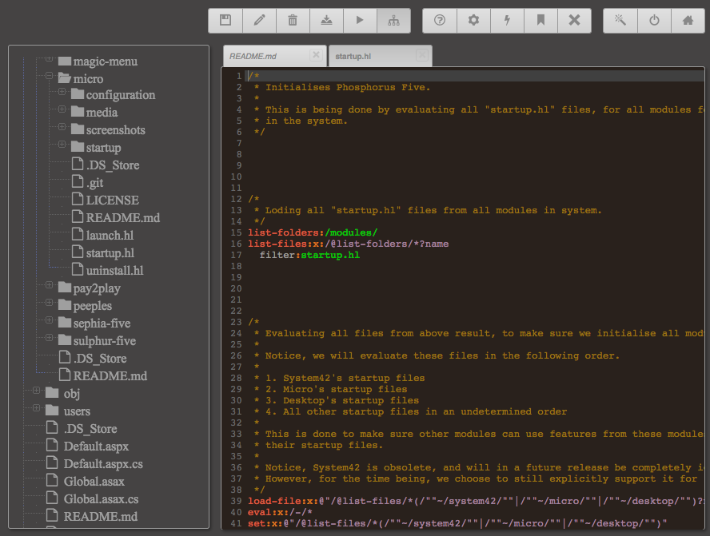
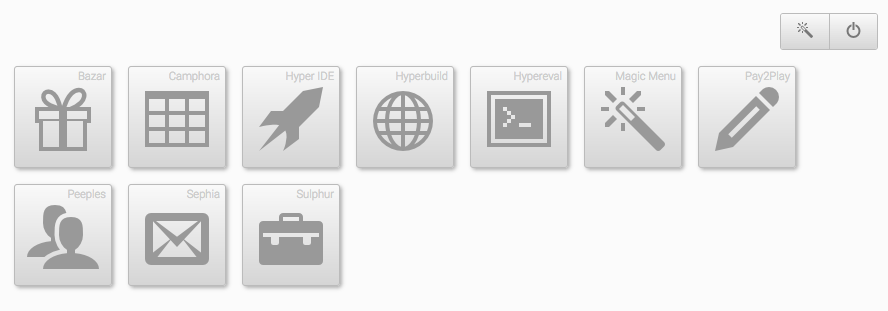

# Micro CSS Framework

Micro is a microscopic CSS and Ajax framework. It can be used stand alone as a pure CSS framework, but is 
also a perfect companion with [Phosphorus Five](https://github.com/polterguy/phosphorusfive). 
It was created because of Bootstrap being too big, and other smaller framework not having the 
necessary features. Most of the existing CSS framework were also often too JavaScript centric, 
including Bootstrap. Below is a screenshot of how Micro looks like in [Hyper IDE](https://github.com/polterguy/hyper-ide).

Micro builds upon a `container/row/col` structure, and is such quite similar to Bootstrap CSS, but is
significantly smaller in size, and created around the _"flexbox CSS model"_. The last point makes it a
more modern CSS framework than Bootstrap. Micro is also extremely easy to skin, due to its clever use 
of CSS variables, making it much easier to modify any aspect of your HTML hierarchy, by simply creating 
your own skin, and override a couple of CSS variables.

You can use Micro as a stand alone CSS framework, or you can use it in combination with Phosphorus Five.
If you choose the latter, you can [download Phosphorus Five here](https://github.com/polterguy/phosphorusfive/releases),
which includes Micro, Hyper IDE, and everything you need to get started with Phosphorus Five development.

Micro also includes a whole range of additional extension Ajax widgets if you choose the latter. Below is
a screenshot of the _"desktop"_ in Phosphorus Five, entirely made from Micro.

## License

Micro is distributed under the terms of the GPL version 3 license, but [proprietary options exists](https://gaiasoul.com/license/)
if you wish to use it to create closed source software.
